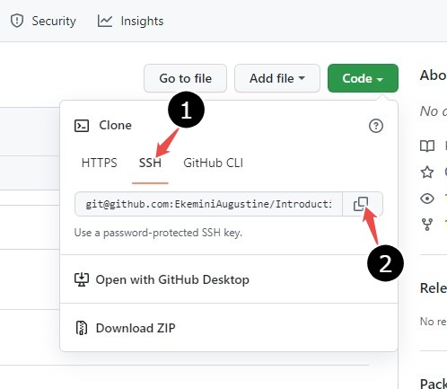
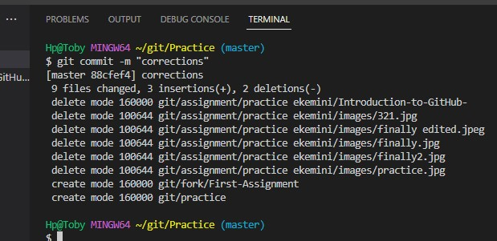

# Introduction to GitHub 
## Table of content 
1. What is GitHub?
2. Why GitHub?
3. Git vs. GitHub
4. Clone in GitHub
5. Pull request 
6. Commit 
7. Git Desktop vs. Git CLI
8. Conclusion

## Introduction 
If you are in the software industry, then most likely you have heard about GitHub.  GitHub is a platform that provides code hosting services. You may use it as cloud storage for your projects, or you may use it to show your code to potential employers interested in assessing your skills. GitHub is more than simple storage, hence it is important to ask “What is GitHub?”
 In this guide, you will:
- know what GitHub is about
- know why you should use GitHub
- learn the differences between Git and GitHub; GitHub Desktop and GitHub CLI
- learn how to perform basic operations like clone, pull requests, and make commits on GitHub. 

## What is GitHub?
GitHub is a code hosting platform. It creates a platform for collaboration,  where people can work on projects from anywhere in the world. It is a tool used by individuals and teams alike all across the world to collaborate virtually on any kind of project.
Wikipedia describes it as an Internet hosting service for software development and version control using Git. It provides the distributed version control of Git, plus access control, bug tracking, software feature requests, task management, continuous integration, and wikis for every project. 

## Why GitHub?
The GitHub platform provides users with diverse benefits. Some of these benefits include:
### 1. Excellent documentation: 
GitHub provides a good platform on which you can document your projects. With GitHub, you can record and track your progress. 

### 2. Exhibit your work: 
Most companies, when looking for recruits, look into GitHub profiles. GitHub provides you with a platform to showcase your work, thereby increasing your chances of being recruited.

### 3. GitHub is a repository:
 GitHub enables you to deposit and store your projects. It gives your work the required publicity. As one of the largest coding communities, it gives your project wide exposure. 

### 4. Ability to track changes: 
When a project is revised and changes are made, it is hard to track those changes. GitHub solves this issue by keeping track of changes such as who said what, when, and where those files are stored.

### 5. It makes contributions easier:
If your project is open source,  GitHub makes it simpler to add more in-depth documentation and get feedback about your projects. You can also make contributions to other projects.

## Git vs. GitHub

Image from https://ithouse.io/about-us/branching-illustration2x/.

According to Ekaterina Novoseltseva, GitHub can be divided into Git and the Hub; "Git" implies the version control system,  a tool which allows developers to keep track of the constant revisions of their code, while the "hub" is the community of like-minded individuals who participate. 

Git and GitHub complement each other and the difference between them is in how they function. Git can be thought of as a single computer system working alone, and GitHub as a connection of interconnected computer systems, performing different roles, but with the sole aim to achieve the same goal. GitHub is designed to help you manage open-source projects that use Git. GitHub simply expands things further than Git. Some of the differences between Git and GitHub can be summarized as follows:

|Git | GitHub|
|------|-----------|
|Git is a command line tool, focused on code sharing and version control | GitHub is a graphical user interface, focused on centralised source code hosting|
|It has no management feature, with minimal external tool configuration| It has in-built user management features, with an active market space|
|It is a software, installed locally on the system | It is a service, hosted on the web|
|It is a version control system that lets you manage and keep track of your source code history | It is a cloud-based hosting service that lets you manage Git repositories |
|The operations of Git are limited | GitHub offers connectivity,  expandability, and resources, as well as a place to deposit and collaborate on projects |

## Cloning in GitHub
Cloning in GitHub implies making a copy of a repository, to duplicate and copy everything in the repository. Cloning is done to make changes, edit a repository or fix emerging conflicts in a repository. Cloning can be done to files you have access to by following the steps below :

1. Open your GitHub account
2. Select the repository you want to clone
3. Click on the repository to show the file options and click on **code** as shown below. 
4. Click on **SSH** and copy the URL as shown below. 
5. Select the location where you want the cloned repository to be
6. Type **Git clone** and the paste the URL you copied earlier
7. Press **enter** to create the cloned repository.

If you clone a repository that you do not have write access to, GitHub Desktop will create a fork. After creating or cloning a fork, GitHub Desktop will ask how you are planning to use the fork.
- If you plan to use this fork for contributing to the original upstream repository, click  **To contribute to the parent project**. And then click **Continue**.
- If you plan to use this fork for a project not connected to the upstream, click **For my own purpose**, then you click **continue**. 

 ## Pull request
The GitHub platform allows you to make changes to your documents. The process of telling people about the changes you've made to a project, to review the changes with your collaborators is described as a pull request. Pull request creates an avenue for changes to be discussed and reviewed before they are merged up into the base branch.  The pull request simply displays differences to compare the changes to be merged into the main work. To carry out a pull request, the following steps can be followed: 

1. On GitHub.com, navigate to the main page of the repository. 

2. In the **Branch** menu, choose the branch that contains your commits.

3.  Above the list of files click on **pull request** as shown below. 

4. Use the base branch dropdown menu to select the branch you'd like to merge your changes into, then use the compare branch drop-down menu to choose the topic branch you made your changes in. 

5. Type a title and description for your pull request as shown below 

6. To create a pull request that is ready for review, click **create pull request**.  To create a draft pull request, use the drop-down and select **create pull request** and then pick **draft pull request** as shown below

7. After your pull request has been reviewed, it can be merged into the repository. 

 ## Commit
 
  
After making changes to a file, just like saving the edited file, a commit records the changes done to the files. A commit contains information such as the specific changes done, who created the changes, and when the changes were made. Every time you save the state of your project at any time, Git takes a snapshot of what your files look like at the moment and stores it as a reference. Commit shares the changes you've made to the local repository only. The changes are done locally, they are not automatically synchronized to the remote repository and so when you want to share them with other developers, you have to push them back to the repository that you all share. 
- To make a Git Commit, you start by typing **git commit** on your terminal or command prompt which brings up a Vim interface for entering the commit message as shown below
- On the first line, type the subject of your commit. Remember to keep it short. Next, you write a detailed description of the committed change. Use multiple paragraphs to give a detailed explanation. Your commit message should answer three primary questions;
- - why is this change important?
- - what effect do the changes have?
- - how does this commit address the issue?

- Then you click on **Commit changes**, or you press **Esc** and then type **:wq**. 

Commit messages makes it easier to understand why a change was made. And also, in the long run, would make it easier for further changes to be made to a project because they understand the code.

## GitHub Desktop vs. GitHub CLI
GitHub Desktop is an application that enables you to interact with GitHub using a GUI (Graphical User Interface ). GUI according to Wikipedia, is a form of user interface that allows users to interact with electronic devices through graphical icons instead of text.
GitHub CLI (Command Line Interface) is a command tool that allows GitHub features and actions to be accessible to your terminal, so you can complete all your actions in one place.
The GitHub CLI is recommended for use as it saves more time and provides speed. The Slant Community gives the following advantages of the Command Line Interface over the GitHub Desktop:

- Using CLI gives access to every single git function.

- By using Git from the command line, it gives a better understanding of how Git functions. 

- It is fast and straightforward. 

- It gives you full control over what is happening. 

- You can customize it and/or integrate it into automated workflows.

- It is simple to use.

-  With Git CLI, a visual representation of various branches and how they are merged is possible. 

- It is the same on every platform. 

## Conclusion
GitHub has become one of the largest coding communities, providing a wide range of benefits. GitHub can integrate with platforms and services such as Google Cloud, Amazon, and Code Climate to track your projects and changes, and can highlight syntax in several programming languages. 
If you are working on an exciting project, GitHub is the platform to.

